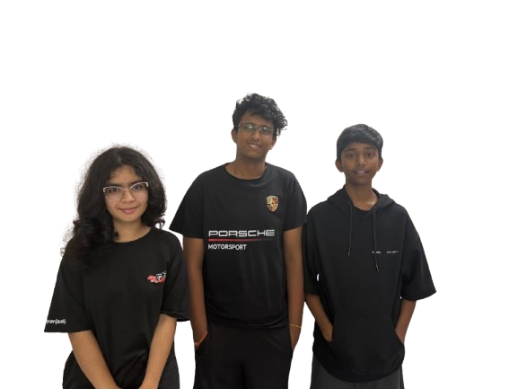

# WRO Future Engineers 2025 – Yo-Wroom

> *Full-mark scoring autonomous vehicle design for the WRO 2025 Future Engineers category, using Raspberry Pi based control platforms.*

---

## Table of Contents

- [Overview](#overview)
- [Repository Structure](#repository-structure)
- [Team Members](#team-members)
- [Hardware](#hardware)
  - [Components](#components)
  - [Mobility System](#mobility-system)
  - [Power & Sensors](#power--sensors)
- [Software](#software)
  - [Setup & Initialization](#setup--initialization)
  - [Simplified code implementation of Mobility system.](#simplified-code-implementation-of-Mobility-system.)
  - [Object Detection & Navigation](#object-detection--navigation)
  - [Driving Strategies & Challenge Logic](#driving-strategies--challenge-logic)
- [Assembly Instructions](#assembly-instructions)
- [Potential Improvements](#potential-improvements)
- [License / Acknowledgements](#license--acknowledgements)

---

## Overview

This project is a **autonomous vehicle** designed to achieve full marks in the *WRO Future Engineers 2025* challenge.  
It serves as both a **learning platform** for participating teams and a **benchmark bot** for testing driving logic, wall-following algorithms, and challenge-specific maneuvers.  

Key features:  
- **Front-wheel steering** and **rear-wheel drive** design for realistic vehicle dynamics.  
- **Raspberry Pi 4B** for vision-based navigation and sensor control and **Raspberry Pi BUILD HAT** for direct motor and sensor control.  
- Three ultrasonic sensors and two LiDAR for accurate wall following and close range wall detection.  
- Gyroscope, magnetometer and accelerometer-based orientation stabilization.  
- Modular software for quick adaptation to custom strategies.  
---

## Repository Structure

| Directory        | Description                              |
|------------------|------------------------------------------|
| `pi-install/src` | Installation script                      |
| `team_photos`         | Team photos  |
| `vehicle_photos`     | Images of the completed robot builds           |
| `wroprg`         | Source code in Python                    |
| `README.md`      | Project documentation (this file)        |
| `schematic.jpg`      | Circuit schematic diagram       |

---

## Team Members
<p align="center">
  
</p>

- **Kanak Arora** – Lead Programming and Electronics and Basic build development – [yolabteachers2@gmail.com](mailto:yolabteachers2@gmail.com)
- **Rachit Tiwari** – Electronics, Program development and Overall strategy – [yolabs007@gmail.com](mailto:yolabs007@gmail.com)  
- **Mohit Kuriseti** – Electronics, Build development and Program development  – [yolabs007@gmail.com](mailto:yolabs007@gmail.com)
- **Saurabh Arora** – Coach for team Yo-Vroom – [support@yolabs.in](support@yolabs.in)
- **Team YoLabs** – WRO Future Engineers preparation and reference build development.  


---

## Hardware

### Components

| Component         | Description                             | Notes                                 |
|-------------------|-----------------------------------------|---------------------------------------|
| Chassis           | Lego Spike Prime Default chassis                | Optimized for stability & handling   |
| Spike Prime Large Motor  | Rear-wheel drive                        | Controlled via Raspberry Pi BUILD HAT     |
| Spike Prime Small Motor    | Front wheel steering system           | Controlled via Raspberry Pi BUILD HAT     |
| Raspberry Pi 4B   | Main processing unit                    | Runs vision & navigation algorithms, distance sensor control  |
| Raspberry Pi Camera Module        | Vision input, Front and side distance confirmation                            | Front-mounted, wide-angle lens       |
| Raspberry Pi BUILD HAT   | Control unit for all LEGO Education Spike Prime components                 | Handles motors & colour sensor input |
| Spike Prime Colour sensor        | Detecting direction through line colour on mat           |  Controlled via Raspberry Pi BUILD HAT|
| BNO055           | Gyroscope, accelerometer and magnetometer module for orientation feedback             | I2C connected to Raspberry Pi               |
| Ultrasonic Sensor (×3) | Distance measurement                | Mounted front, left & right for wall following and front wall detection |
| Li-ion Battery (x4)      |  18650 3.6V 3500mAh                            | Powers motors, electronics, BUILD HAT & Raspberry Pi|
| OLED display          | For error and info display           | I2C connected to Raspberry Pi             |
| VL53L0X LiDAR Sensors (x2)          | For close range distance detection.          | I2C connected to Raspberry Pi             |
| Misc.            | Smaller components for errors and info, connectors, wiring  |                                        |


### Mobility System

- **Configuration:** Front-wheel steering with a single Motor rear drive motor.  
- **Turning Radius:** Optimized for narrow WRO track corners.  
- **Control:** PWM-based speed control, Gear mechanism-based steering.  
- **Build Choice Reasoning:** Offers realistic car-like dynamics, ideal for FE challenge simulation.  

**Possible enhancements:** Lighter chassis for better acceleration, Stronger front motor/servo for steeper turning radius.

### Power & Sensors

- **Power:**  
  - 4x 18650 3.6V 3500mAh Li-ion Batteries connected in parallel for powering Raspberry Pi, Motors and all Sensors and Electronics through Raspberry Pi BUILD HAT. 
- **Sensors:**  
  - **Ultrasonic (Front, Right, Left):** Wall distance, corner detection and wall following
  - **BNO055:** Fuses data from an accelerometer, gyroscope, and magnetometer to give accurate yaw readings. 
  - **Raspberry Pi Camera Module:** Vision-based navigation, obstacle and challenge detection.  
  - **Spike Prime Colour sensor:** Direction Detection from mat line colour.
  - **Small LiDAR (Right, Left):** Close Range wall detection.
  

---

## Software

### Setup & Initialization

1. **Raspberry Pi:**
   - Flash Raspberry Pi OS Lite.
   - Enable SSH, I2C, and Camera support.
   - Install Python dependencies:  
     ```bash
     pip install opencv-python numpy imutils
     ```
   - Clone this repository:
     ```bash
     git clone https://github.com/saurabharora2021/wrofutureengineer2025
     ```
2. **Raspberry Pi BUILD HAT:**
   - Install Python dependencies:  
     ```bash
     wrofutureengineer2025/pi-install/src/install_service.sh
     ```
### Simplified code implementation of Mobility system.
<pre markdown="1"> 
[Initialization]
      |
      v
[Sensor Calibration & IMU Stabilization]
      |
      v
[Wall Following + Yaw Correction]
      |   \
      |    --(corner detected by side sensor)--> [Turn Initiation]
      |                                         |
      |                                         v
      |                                   [Waiting for Turn Completion]
      |                                         |
      |                                         v
      |-------------------------------<---------- 
      |
      v
[Lap Complete] --(final edge counted)--> [Stopped]
 </pre>


### Object Detection & Navigation

- **Vision Processing (OpenCV on RPi):**
  - Detecting front wall.
  - Detecting track Obstacles.
  - Approximate distance calculation(not accurate) in extreme cases to avoid running into walls.
- **Sensor Integration:**
  - Ultrasonic sensors for precise wall-following.
  - LiDAR sensors for close range detection.
  - BNO055 for orientation drift correction.
  - Colour sensor pointing towards ground to detect direction.

### Driving Strategies & Challenge Logic

- **Wall Following:** PD-controlled steering using right and left ultrasonic distance and Small LiDAR sensors. LiDAR sensors are used for close range wall detection(15cm).
- **Corner Detection:** Front ultrasonic + camera-based detection to initiate turns.
- **Lap Completion:** BNO055 + distance tracking to ensure accurate lap counts.
- **Recovery Logic:** If bot drifts, slow down and re-center before resuming speed.
- **Straight Walk:** Distance sensor, LiDAR, Camera and BNO055(gyroscope, magnetometer and accelerometer module) fusion for smooth path control.

---

## Assembly Instructions

1. **Chassis Prep:**  
   - Mount Raspberry Pi LEGO Education Spike Prime plate onto base chasis.  
2. **Steering Mechanism:**  
   - Mount LEGO Education Spike Prime Small Motor.
   - Make Gear mechanism for steering (Gear ratio is 3:5).
3. **Electronics Install:**
   - Mount the custom circuit based on the uplaoded circuit schematics.
   - Mount RPi on vibration-dampened standoffs.  
   - Mount LEGO Education Spike Prime Large Motor.
   - Mount LEGO Education Spike Prime Colour sensor.
   - Mount Raspberry Pi BUILD HAT on top of Raspberry Pi.
   - Mount and connect all other sensors and electronics.
4. **Power Wiring:**  
   - Ensure regulated supply to Raspberry Pi BUILD HAT.  
5. **Testing:**  
   - Test each component (motors, sensors) individually.  
   - Run calibration scripts before full run.

---

## Potential Improvements

- Integrate stronger LiDAR for higher-precision mapping. 
- Use lighter Chassis and more open source hardware to decrease errors. 
- Improve computer vision FPS via GPU acceleration on RPi.  
- Add auto-calibration for ultrasonic sensors.  
- Experiment with reinforcement learning for adaptive driving.

---

## License / Acknowledgements

This project is licensed under the [MIT License](LICENSE).  

Special thanks to:  
- [OpenCV](https://opencv.org/) – Computer vision processing.  
- [Raspberry Pi Foundation](https://www.raspberrypi.org/) – SBC platform.  
- [Raspberry Pi BUILD HAT](https://www.raspberrypi.com/documentation/accessories/build-hat.html) – Integrating LEGO Education Spike Prime hardware with raspberry pi.
- WRO community and participating teams for continuous inspiration.

---

> For any questions or feedback, please feel free to contact us via email or open an issue on this repository.
